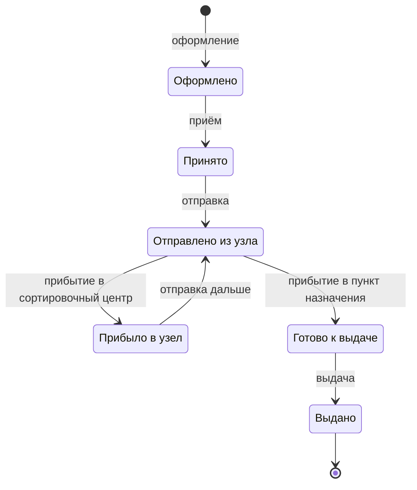

<div align="center">

# 📦 ИСУДО

### Информационная система управления доставкой отправлений

Веб-приложение для оформления, обработки, отслеживания и выдачи отправлений в сети пунктов обслуживания и сортировочных центров.


</div>

> Учебный командный проект НИУ ВШЭ — МИЭМ им. А. Н. Тихонова по дисциплине «Технология разработки программного обеспечения».

## О проекте

ИСУДО поддерживает полный базовый цикл доставки: от оформления отправления в пункте обслуживания до выдачи получателю. Система хранит текущее состояние и историю перемещения, контролирует допустимость операций и предоставляет клиенту публичное отслеживание по трек-номеру.

Проект разрабатывается как компактный MVP, ориентированный на четыре категории пользователей.

## Возможности

- оформление отправления и присвоение уникального трек-номера;
- изменение исходных сведений до фактического приёма;
- регистрация приёма, отправки и прибытия в узел;
- ручной выбор следующего сортировочного центра или пункта назначения;
- автоматический перевод в статус «Готово к выдаче» при прибытии в пункт назначения;
- выдача отправления получателю с фиксацией времени и события;
- публичное отслеживание статуса, последнего узла и истории движения;
- ведение рабочих списков отправлений для каждого узла;
- управление сотрудниками, ролями и учётными записями;
- управление пунктами обслуживания и сортировочными центрами.

## Роли пользователей

| Роль | Возможности |
|---|---|
| **Клиент** | Отслеживание отправления по трек-номеру без регистрации и авторизации |
| **Оператор пункта обслуживания** | Оформление и приём отправлений, отправка в следующий узел, регистрация прибытия в пункт назначения и выдача |
| **Сотрудник сортировочного центра** | Регистрация прибытия отправления в свой центр и отправка в выбранный следующий узел |
| **Администратор** | Управление сотрудниками, ролями, пунктами обслуживания и сортировочными центрами |

## Жизненный цикл отправления



Каждое изменение состояния фиксируется в истории. Недопустимые переходы отклоняются, а статус «Выдано» является конечным.

## Ключевые правила

- трек-номер состоит из 16 латинских букв верхнего регистра и цифр;
- пункт приёма определяется по учётной записи оператора;
- пункт назначения выбирается из активных пунктов обслуживания и должен отличаться от пункта приёма;
- следующий узел сотрудник выбирает вручную из доступных активных узлов;
- прибытие может зарегистрировать только сотрудник узла, выбранного следующим;
- изменение статуса и добавление события в историю выполняются как единая операция;
- сведения об отправлении можно исправлять только до его приёма;
- повторная выдача и любые операции после выдачи запрещены;
- записи, связанные с историей отправлений, не удаляются.

## Доступ и защита данных

- сотрудники входят в систему по логину и паролю и работают в рамках назначенной роли и узла;
- публичное отслеживание не раскрывает персональные данные участников и сотрудников;
- сотрудникам сортировочных центров недоступны сведения о личности и телефоны отправителя и получателя;
- реквизиты документов доступны только уполномоченным операторам при приёме и выдаче;
- пароли хранятся в виде стойких адаптивных хешей с солью;
- блокировка сотрудника прекращает доступ при следующем запросе.

## Сервисы и адреса

Состав окружения описан в [docker-compose.yml](./docker-compose.yml).
Адреса ниже рассчитаны на запуск Docker на вашем компьютере.

| Сервис | Назначение | Адрес на компьютере | Порт внутри контейнера | Где находится код или данные |
|---|---|---|---|---|
| `app` | Основное приложение: FastAPI, HTML-интерфейс и API | [http://localhost:8443](http://localhost:8443) | `8000` | Код в `app/`, сборка через корневой `Dockerfile`; внутри контейнера проект находится в `/app` |
| `db` | PostgreSQL 16: отправления, история, сотрудники, сессии и справочники | `localhost:5432` для SQL-клиента | `5432` | Docker-том `pgdata`, подключённый к `/var/lib/postgresql/data`; модели в `app/models.py`, миграции в `alembic/` |
| `docs` | nginx с готовой документацией Doxygen | [http://localhost:8080](http://localhost:8080) | `80` | Сборка через `docs/Dockerfile`, настройки в `Doxyfile`, страницы в `docs/doxygen/`; готовый сайт в `/usr/share/nginx/html` контейнера |

Основное приложение использует **HTTP**, в том числе на порту `8443`:
TLS в текущей конфигурации не настроен. PostgreSQL открывается через клиент
базы данных, например `psql`, а не как веб-страница.

Внутри сети Compose приложение обращается к БД по имени сервиса `db:5432`.
База и пользователь в текущей конфигурации называются `isudo`; параметры
подключения задаются в `docker-compose.yml`. Данные БД сохраняются в томе
при пересоздании контейнера. Фактическое имя тома обычно имеет префикс проекта:
`<имя-проекта>_pgdata`.

### Страницы основного приложения

| Страница | Адрес |
|---|---|
| Отслеживание без авторизации | [http://localhost:8443/tracking](http://localhost:8443/tracking) |
| Вход сотрудника | [http://localhost:8443/login](http://localhost:8443/login) |
| Рабочее место оператора | [http://localhost:8443/operator](http://localhost:8443/operator) |
| Рабочее место сортировщика | [http://localhost:8443/sorter](http://localhost:8443/sorter) |
| Администрирование | [http://localhost:8443/admin](http://localhost:8443/admin) |
| Swagger UI — интерактивное описание API | [http://localhost:8443/docs](http://localhost:8443/docs) |
| Спецификация OpenAPI | [http://localhost:8443/openapi.json](http://localhost:8443/openapi.json) |
| Проверка доступности HTTP-приложения | [http://localhost:8443/health](http://localhost:8443/health) |

Рабочие места требуют входа с соответствующей ролью. API размещён под
префиксом `/api/v1`. Swagger UI обслуживается основным приложением,
а документация по исходному коду Doxygen — отдельным сервисом `docs` на порту `8080`.

### Запуск и управление

Выполняйте команды из корня репозитория. Если Compose установлен отдельной
командой, используйте `docker-compose` вместо `docker compose`.

```bash
# Все три сервиса
docker compose up --build -d

# Только приложение и его база данных
docker compose up --build -d app

# Только документация, без запуска приложения и БД
docker compose up --build -d docs

# Состояние сервисов и просмотр журналов
docker compose ps
docker compose logs -f app db docs

# Остановка сервисов с сохранением данных
docker compose stop
```

При запуске `app` Compose ожидает готовности `db`; затем скрипт `entrypoint.sh`
применяет миграции, создаёт начального администратора из переменных окружения
и запускает сервер. Сервис `docs` независим от приложения и БД.

## Документация

| Материал | Содержание |
|---|---|
| **[Техническое задание](./docs/ТЗ_ТРПО_ИСУДО.pdf)** | Назначение системы, функциональные и нефункциональные требования, этапы разработки и порядок приёмки |
| **[Отчёт по лабораторной работе № 1](./docs/ЛР1_ТРПО_ИСУДО.pdf)** | Диаграммы прецедентов, описания основных сценариев, диаграмма деятельности, модель классов предметной области и прототипы интерфейса |

Техническое задание оформлено по ГОСТ 19.201-78. В отчёте описаны пять основных прецедентов: оформление, приём, отправка в следующий узел, регистрация прибытия и выдача отправления.

## Команда

| Участник | Роль |
|---|---|
| **Полина Виговская** | Аналитик |
| **Данила Голубев** | Разработчик |
| **Иван Короткий** | Тестировщик |

## Статус проекта

Проект в разработке. Плановый период реализации: **21 сентября — 2 декабря 2026 года**.

## Документация Doxygen

Справочник по Python-коду, архитектуре и операциям доставки генерируется на русском
языке в HTML и RTF. Конфигурация находится в `Doxyfile`, обзорные страницы —
в `docs/doxygen/`, комментарии — непосредственно в исходном коде.

Запуск отдельного сервиса документации (приложение и БД не требуются):

```bash
docker compose up --build -d docs
```

Откройте **http://localhost:8080**. Если используется отдельная команда
`docker-compose`, замените ею `docker compose`.

На главной странице доступны скачивание RTF и архив RTF с изображениями.
Для документа с диаграммами распакуйте архив и откройте `rtf/refman.rtf`,
сохранив соседние файлы. После изменения исходников повторите команду с
`--build`, чтобы обновить документацию. Остановка: `docker compose stop docs`.

Для локальной сборки установите Python 3.10+, Doxygen и Graphviz и выполните из корня:

```bash
mkdir -p build/doxygen
doxygen Doxyfile
```

Результат: `build/doxygen/html/index.html` и `build/doxygen/rtf/refman.rtf`.
Генерируемые файлы не включаются в Git. Первая Docker-сборка требует сети
для загрузки образов и пакетов; последующий просмотр работает локально.
